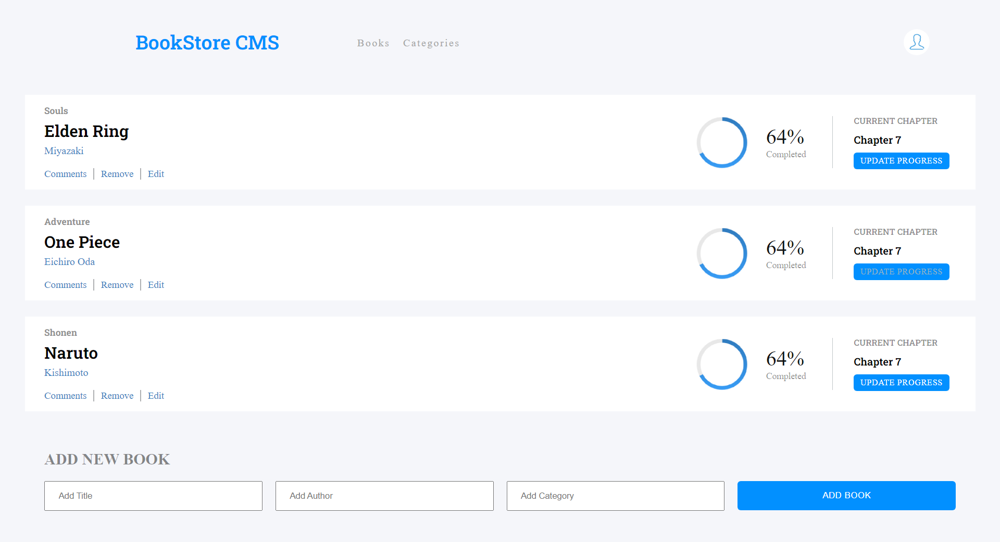

# BookStore

> The amazing BookStore project will let you display, add and remove the books you are currently reading.
> The books are stored online.

## Built With

- React
- Redux

## Screenshots

## Getting Started

To get a local copy up and running:

1. Clone this repository or download the zip folder:

**`git clone https://github.com/rex-9/BookStore.git`**

2. Navigate to the location of the folder in your machine:

**`you@your-Pc-name:~$ cd BookStore`**

3. Open the project with VScode:

**`code .`**

4. Build the node packages:

**`npm run build`**

5. Run the server:

**`npm start`**

### Deployment

Here is the online version of [BookStore](https://rex9bookstore.netlify.app/)

## Author

👤 - Github: [rex-9](https://github.com/rex-9/) 
👤 - LinkedIn: [rex9](https://www.linkedin.com/in/rex9/) 
👤 - Angelist: [rex9](https://angel.co/u/rex9) 
👤 - Facebook: [Htet Naing](https://www.facebook.com/htetnaing0814) 

## 🤝 Contributions

Contributions, issues, and feature requests are welcome!

Feel free to check [issue page](https://github.com/rex-9/BookStore/issues).

## Show your support

Give a ⭐️ if you like this project!

## Acknowledgments

[Microverse](https://bit.ly/MicroverseTN)

## 📝 License

This project is [MIT](./MIT.md) licensed.
